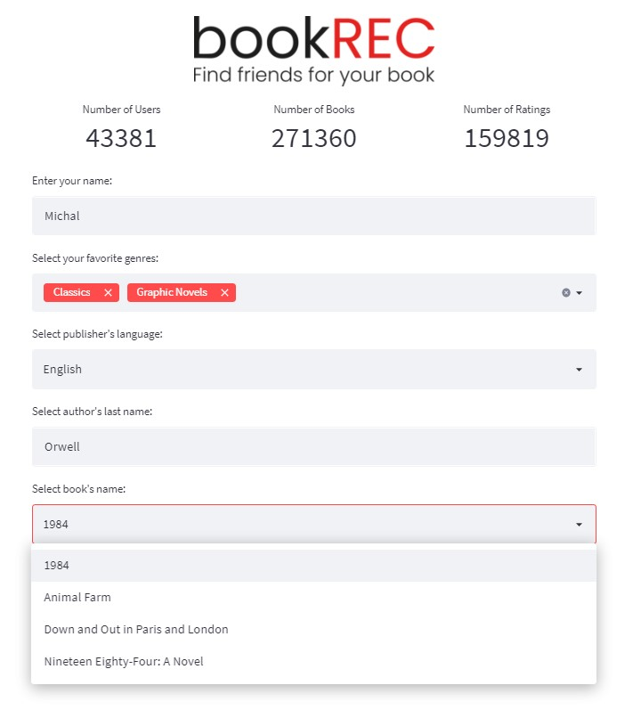
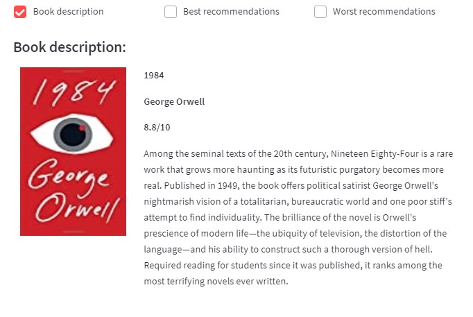
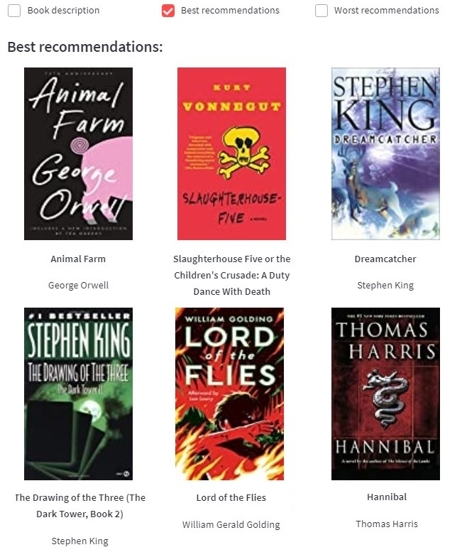

# BookREC
This project was built with Streamlit.
## Library installation
1. Create your environment:  
```
python -m venv venv
```
2. Activate your environment:  
```
book_app\venv\Scripts\activate.bat
```
3. Install requirements:  
```
pip install -r requirements.txt
```
## Streamlit app:
### About Streamlit
[Streamlit](https://streamlit.io/) is an open-source Python library that makes it easy to create and share beautiful, custom web apps for machine learning and data science. In just a few minutes you can build and deploy powerful data apps.
### View documentation:
How to use [docs](https://docs.streamlit.io/).
```
streamlit docs
```
### Run Streamlit
Runs your app. At any time you can stop the server with Ctrl+c.  
```
streamlit run run.py
```  
## Preview app


